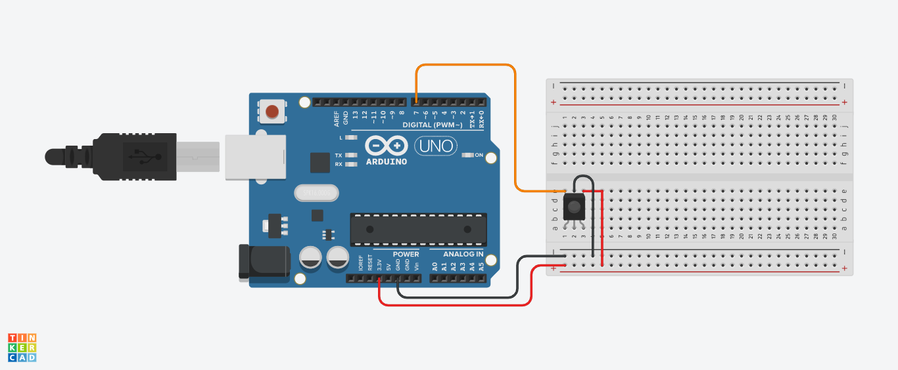

<h1 align="center">INFRA VERMELHO COM ARDUINO</h1>
<h4>A Biblioteca usada foi a IRremote </h4>

~~~c++

#include <IRremote.h>
int RECV_PIN = 30; // porta digiral para receber informações do infra vermelho
IRrecv irrecv(RECV_PIN);
decode_results results;
#include <ArduinoJson.h>

void setup()
{
  Serial.begin(9600);
  irrecv.enableIRIn();
  pinMode(2, OUTPUT);
}
void loop()
{

  if (irrecv.decode(&results))
  {
    Serial.println(" ");
    Serial.print("Código: ");
    //Serial.println(results.value); mostra o código ao ser precionado
    const int ALL_ON_CODE = results.value;
    Serial.println(ALL_ON_CODE); // vai conter o código que será usado nas condições
    Serial.println(" ");

    if (ALL_ON_CODE == 765)
    {
      Serial.println("-------------------------------------------");
      Serial.println("|   Botão Ligar/Desligar foi precionado    |");
      Serial.println("-------------------------------------------");
      digitalWrite(2, HIGH);
      delay(100);
      digitalWrite(2, LOW);
    }
    else
    {
      if (ALL_ON_CODE == 29325)
      {
        Serial.println("-------------------------------------------");
        Serial.println("|          Botão 1 foi precionado           |");
        Serial.println("-------------------------------------------");
        digitalWrite(2, HIGH);
        delay(100);
        digitalWrite(2, LOW);
      }
      else
      {
        if (ALL_ON_CODE == -20401)
        {
          Serial.println("-------------------------------------------");
          Serial.println("|          Botão 2 foi precionado          |");
          Serial.println("-------------------------------------------");
          digitalWrite(2, HIGH);
          delay(100);
          digitalWrite(2, LOW);
        }
        else
        {
          if (ALL_ON_CODE == 12495)
          {
            Serial.println("-------------------------------------------");
            Serial.println("|        Botão 3 foi precionado           |");
            Serial.println("-------------------------------------------");
            digitalWrite(2, HIGH);
            delay(100);
            digitalWrite(2, LOW);
          }
          else
          {
            if (ALL_ON_CODE == 21165)
            {
              Serial.println("-------------------------------------------");
              Serial.println("|          Botão 4 foi precionado          |");
              Serial.println("-------------------------------------------");
              digitalWrite(2, HIGH);
              delay(100);
              digitalWrite(2, LOW);
            }
            else
            {
              if (ALL_ON_CODE == -28561)
              {
                Serial.println("-------------------------------------------");
                Serial.println("|          Botão 5 foi precionado          |");
                Serial.println("-------------------------------------------");
                digitalWrite(2, HIGH);
                delay(100);
                digitalWrite(2, LOW);
              }
              else
              {
                if (ALL_ON_CODE == 4335)
                {
                  Serial.println("-------------------------------------------");
                  Serial.println("|          Botão 6 foi precionado          |");
                  Serial.println("-------------------------------------------");
                  digitalWrite(2, HIGH);
                  delay(100);
                  digitalWrite(2, LOW);
                }
                else
                {
                  if (ALL_ON_CODE == 25245)
                  {
                    Serial.println("-------------------------------------------");
                    Serial.println("|          Botão 7 foi precionado          |");
                    Serial.println("-------------------------------------------");
                    digitalWrite(2, HIGH);
                    delay(100);
                    digitalWrite(2, LOW);
                  }
                  else
                  {
                    if (ALL_ON_CODE == -24481)
                    {
                      Serial.println("-------------------------------------------");
                      Serial.println("|          Botão 8 foi precionado          |");
                      Serial.println("-------------------------------------------");
                      digitalWrite(2, HIGH);
                      delay(100);
                      digitalWrite(2, LOW);
                    }
                    else
                    {
                      if (ALL_ON_CODE == 8415)
                      {
                        Serial.println("-------------------------------------------");
                        Serial.println("|          Botão 9 foi precionado          |");
                        Serial.println("-------------------------------------------");
                        digitalWrite(2, HIGH);
                        delay(100);
                        digitalWrite(2, LOW);
                      }
                      else
                      {
                        if (ALL_ON_CODE == -32641)
                        {
                          Serial.println("-------------------------------------------");
                          Serial.println("|          Botão 0 foi precionado          |");
                          Serial.println("-------------------------------------------");
                          digitalWrite(2, HIGH);
                          delay(100);
                          digitalWrite(2, LOW);
                        }
                        else
                        {
                          Serial.println("-------------------------------------------");
                          Serial.println("|    Um botão desconhecido foi precionado   |");
                          Serial.println("-------------------------------------------");
                        }
                      }
                    }
                  }
                }
              }
            }
          }
        }
      }
    }

    irrecv.resume(); // reseta o estado do ISR
  }
}
~~~
 

<blockquote>
  Siga o esquema abaixo 
</blockquote>

